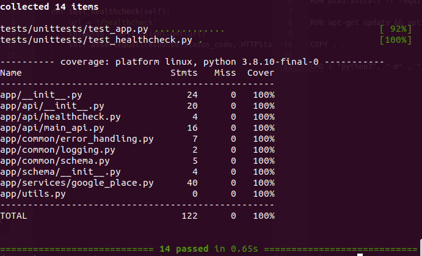

Crawl Phone numbers
-----

I. Basic information
- Programming Language: Python3.8
- Web Framework: Flask

II. Extenstions
- Flask-Restful: A library for quickly building REST APIs
- Marshmallow: A library for serialize/deserialize complex datatypes
- webargs: A library for parsing and validating HTTP request objects
- Sqlalchemy: A library for SQL, just define but not use at this current version.
- Tox-docker: A library for unittests and integration tests

III. Set up environment
```
  - virtualenv -p python3.8 .venv
  - source .venv/bin/activate
  - pip install -r requirements/test.txt
```

IV. Unittest
```
  - tox -e unittests
```

V. Integration tests (Internet connection required)

*The google place's API may update the response, so these tests may be failed*
```
  - docker build --tag app .
  - tox -e integration-tests
```

VI. Coverage
```
- python -m pytest --cov=app
```

